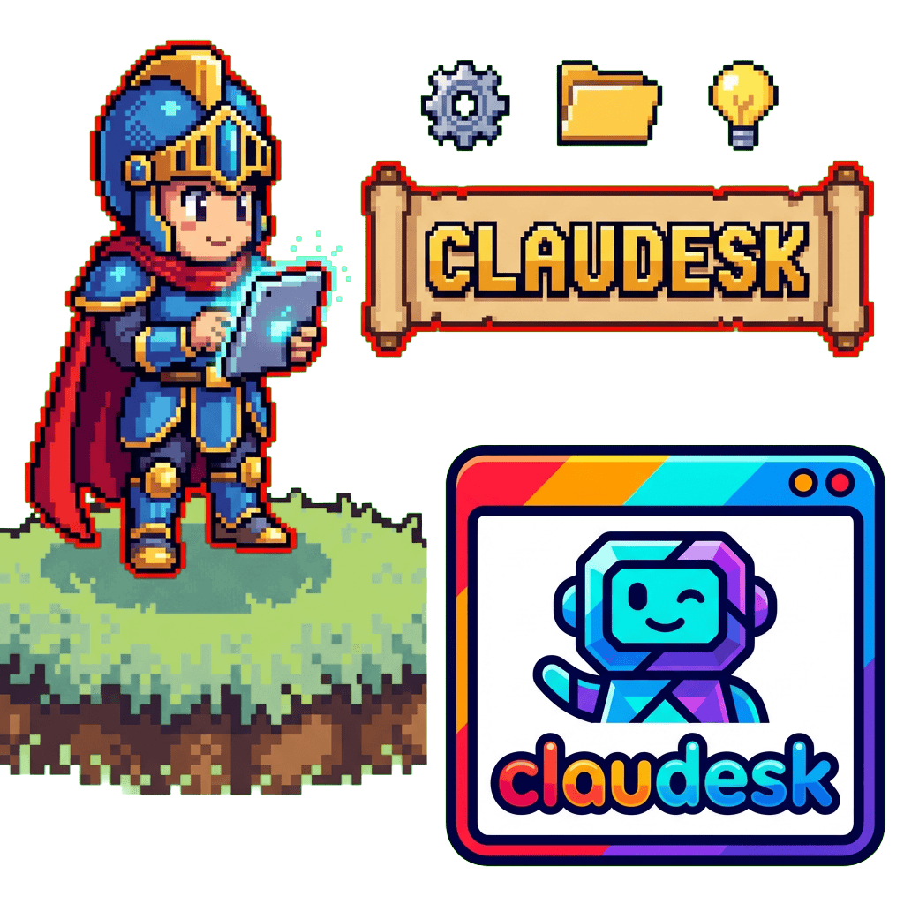

  

  

  🎛️ **Orchestrate Claude Code agents from a single dashboard with real-time monitoring and browser notifications** 🔔

  [Getting Started](#-getting-started) · [Features](#-features) · [Contributing](#-contributing)

---

## ✨ Features

- **Agent Orchestration** — Manage multiple Claude Code agents from one interface
- **Real-Time Monitoring** — Live status updates for all running agents
- **Browser Notifications** — Desktop alerts when agents complete tasks or need attention
- **Dashboard View** — Centralized overview of agent activity and health

## 🚀 Getting Started

*Coming soon — project under active development.*

## 🏗️ Architecture

*Architecture documentation will be added as the project takes shape.*

## 🤝 Contributing

Contributions are welcome! Please open an issue or submit a pull request.

## 📄 License

[MIT](LICENSE)
