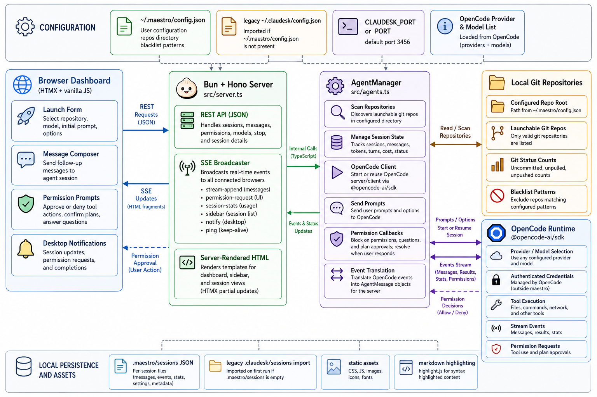

<div align="center">
  

  🖥️ **Interactive dashboard for launching and managing OpenCode agents** ⚡
</div>

maestro is a local web dashboard for running OpenCode agents across your git repositories. It gives you one browser tab for creating sessions, sending follow-up prompts, approving tool permissions, watching live output, and tracking token and cost totals.

The app runs as a Bun + Hono server with server-rendered HTML, HTMX partial updates, and SSE for real-time agent streams.

## Install

```bash
git clone https://github.com/tsilva/claudesk.git
cd claudesk
bun install
bun run dev
```

Open [http://localhost:3456](http://localhost:3456). On first run, maestro asks for the directory that contains your git repositories.

## Commands

```bash
bun run dev                    # start the dev server with file watching
bun run start                  # start the server without file watching
bun bin/claudesk.mjs --no-open # run the CLI entry without opening a browser
```

## Notes

- Requires Bun and an OpenCode setup with authenticated provider credentials.
- Configuration is stored in `~/.maestro/config.json`; legacy `~/.claudesk/config.json` is read if present.
- Set `CLAUDESK_PORT` or `PORT` to override the default port `3456`.
- Session JSON is persisted under repo-root `.maestro/sessions`; legacy `.claudesk/sessions` files can be imported.
- `repoBlacklistPatterns` in the config can hide repositories from the launch list.
- OpenCode file attachments are not supported yet.
- There is no build step, linter, or test command configured; TypeScript runs directly through Bun.

## Architecture



## License

[MIT](LICENSE)
