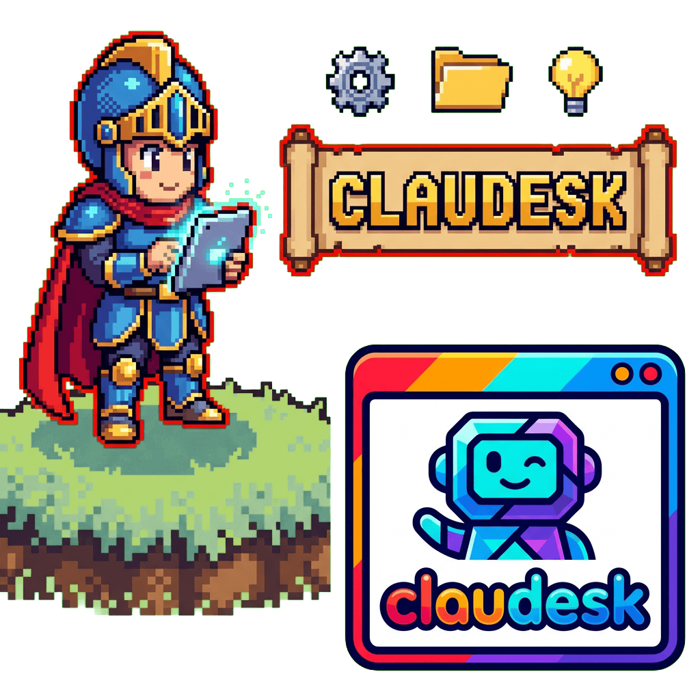

<div align="center">
  

  [](LICENSE)
  [](https://bun.sh)
  [](https://htmx.org)
  [](https://docs.anthropic.com)
  [](https://opencode.ai)

  🖥️ **Interactive dashboard for launching and managing Claude Code and OpenCode agents** ⚡

  [GitHub](https://github.com/tsilva/claudesk)
</div>

---

## 🔍 Overview

**The pain:** Running coding agents across different repositories means juggling terminals, missing permission prompts, and having no central view of what your agents are doing.

**The solution:** claudesk uses the Claude Agents SDK and OpenCode SDK to launch and manage coding agents directly from a web dashboard — start agents, send follow-up prompts, approve permissions, and monitor progress in real time.

**The result:** One browser tab to launch, interact with, and control all your coding agents — with live streaming, permission handling, and desktop notifications.

### ✨ Features

- 🚀 **Launch agents** — start Claude SDK or OpenCode SDK sessions on any git repo from the dashboard
- 💬 **Interactive conversations** — send follow-up prompts and get streaming responses
- 🔐 **Permission handling** — approve or deny tool permissions through the UI
- 📡 **Real-time streaming** — SDK message stream via SSE with HTMX partial updates
- 🧭 **Backend-aware model picker** — switch a new session between Claude SDK and OpenCode SDK models before the first prompt
- 🔔 **Desktop notifications** — instant alerts when an agent needs input
- 📊 **Cost & token tracking** — live token counts, turn stats, and cost per session
- ⏹️ **Agent control** — stop running agents, dismiss completed sessions
- 🎨 **Dark theme** — purpose-built terminal-aesthetic UI with session grouping by repo

### 🛠️ Tech Stack

| Layer | Technology |
|-------|-----------|
| Runtime | [Bun](https://bun.sh) |
| Server | [Hono](https://hono.dev) |
| Agent SDKs | [@anthropic-ai/claude-agent-sdk](https://docs.anthropic.com) + [@opencode-ai/sdk](https://opencode.ai) |
| Frontend | [HTMX](https://htmx.org) + SSE |
| Styling | Vanilla CSS (dark theme) |
| Build step | None |

---

## 🚀 Quick Start

### Prerequisites

- [Bun](https://bun.sh) (v1.0+)
- An Anthropic API key (set `ANTHROPIC_API_KEY` environment variable)
- Optional for OpenCode sessions: the `opencode` CLI installed and whichever provider credentials your OpenCode config uses

### Install & Run

```bash
git clone https://github.com/tsilva/claudesk.git
cd claudesk
bun install
bun run dev
```

Open **http://localhost:3456** — select a repo from the sidebar, create a session, optionally switch its backend/model from the footer picker, then send a prompt.

---

## 🏗️ Architecture

### Data Flow

```
User creates session → POST /api/agents/launch { cwd, backend?, model?, modelProviderId? }
  → AgentManager.createSession()
  → User sends prompt via POST /api/agents/:id/message

Claude session:
  → query({ prompt, options: { cwd, canUseTool, resume? } })
  → for await (msg of generator)
    → transform SDKMessage → AgentMessage → SSE broadcast

OpenCode session:
  → create local OpenCode server/client on demand
  → session.create({ directory }) / session.promptAsync(...)
  → subscribe to OpenCode event stream
  → translate message and permission events → AgentMessage → SSE broadcast
```

### Core Modules

| Module | Purpose |
|--------|---------|
| `src/types.ts` | Shared type definitions (`AgentSession`, `AgentMessage`, `ContentBlock`, etc.) |
| `src/agents.ts` | `AgentManager` — launches SDK agents, consumes streams, handles permissions |
| `src/server.ts` | Hono HTTP server, SSE client management, REST API endpoints |
| `src/templates/` | Server-rendered HTML string templates (layout, sidebar, session detail, components) |
| `static/app.js` | Session switching, SSE reconnection, agent interaction, notifications |

---

## 📡 API Reference

### Pages

| Route | Description |
|-------|-------------|
| `GET /` | Full dashboard page |
| `GET /sessions/:id/detail` | Session detail fragment (HTMX partial) |

### Agent API

| Route | Body | Description |
|-------|------|-------------|
| `GET /api/models` | — | List selectable Claude and OpenCode models |
| `POST /api/agents/launch` | `{ cwd, backend?, model?, modelProviderId?, permissionMode?, preset? }` | Create a new session |
| `POST /api/agents/:id/message` | `{ text }` | Send follow-up message |
| `POST /api/agents/:id/permission` | `{ allow, message? }` | Respond to permission request |
| `POST /api/agents/:id/answer` | `{ answers }` | Answer agent question |
| `POST /api/agents/:id/model` | `{ backend, model, modelProviderId? }` | Change backend/model before first message |
| `POST /api/agents/:id/stop` | — | Stop a running agent |
| `DELETE /sessions/:id` | — | Dismiss a session |

OpenCode note: session messages are supported, but file attachments are currently Claude-only.

### SSE Event Types

| Event | Payload | Purpose |
|-------|---------|---------|
| `stream-append` | Message HTML | New conversation message |
| `permission-request` | Permission UI HTML | Tool permission approval prompt |
| `session-stats` | Stats HTML | Token/turn/cost update |
| `sidebar` | Sidebar HTML | Full sidebar re-render |
| `notify` | JSON | Browser notification trigger |
| `ping` | — | Keep-alive |

---

## 🤝 Contributing

Contributions are welcome! This project uses a simple setup:

```bash
bun install
bun run dev    # Dev server with file watching on port 3456
```

There's no build step, test suite, or linter configured — the server runs TypeScript directly via Bun.

---

## 📄 License

[MIT](LICENSE)
